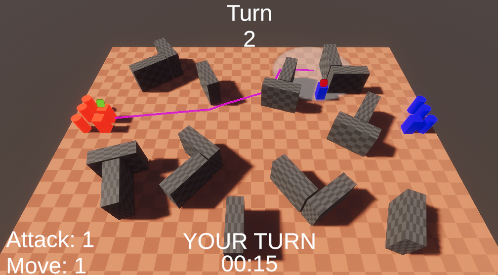

## Основной концепт:

Нужно реализовать многопользовательскую пошаговую стратегическую игру на два игрока.

Игровое поле генерируется на старте сессии.

Два игрока начинают с некоторым определенным набором юнитов (зеркальный набор) по разные стороны игрового поля.

Каждый игрок в свой ход может совершить два действия: Перемещение и Атаку

Перемещение: Игрок может приказать одному любому подконтрольному ему юниту переместится в указанную точку в пределах “скорости” юнита. Чем больше “скорость” у юнита - тем большее расстояние юнит может пройти за один ход.

Атака: Игрок может приказать одному любому подконтрольному ему юниту атаковать юнита противника в пределах “дальности атаки” юнита.
Игрок может завершить свой ход до того как потратит оба действия. Игрок не может использовать два перемещения или две атаки за один ход.
На каждый ход игроку выделяется 60 секунд.

<b>[опционально]</b> Для разрешения ситуаций, когда один игрок избегает боя сделать следующий механизм разрешения ничьей:

- Если на ход номер 15 (или позже) у игроков разное количество юнитов - побеждает игрок у которого осталось больше юнитов
- Если на ход номер 15 у игроков одинаковое количество юнитов - всем юнитам дается бесконечная “скорость” передвижения

## Подробности реализации:
### Игровое поле:
- Игровое поле произвольного размера
- Можно задать какие препятствия могут появляться, и зону в пределах которой препятствия могут появляться
- В каждом отдельном препятствии можно указать минимальное и максимальное количество препятствий этого типа
Можно задать точки появления юнитов для обоих игроков (Допускается зона с рандомизацией положения юнитов)
- Можно задать стартовый состав армий игроков

## Юниты:
- Два типа юнитов - [медленный но дальнобойный] и [быстрый но с малым радиусом атаки]. Здоровье и урон не обязательны, считаем, что у всех одно очко здоровья и одна единица урона
- Левой кнопкой мыши игрок выбирает юнита. Выбранный юнит подсвечивается (Подсветку можно сделать в произвольном виде. Индикатор над юнитом, аутлайн, кружок под юнитом)
- Правой кнопкой мыши прогнозируется путь для данного юнита в точку нажатия (Если нажата левая кнопка мыши, то прогнозируемый путь стирается)
- Двойным нажатием правой кнопки юнит отправляется в указанную точку
- Игрок не может построить путь, который по длине превосходит скорость передвижения юнита и юнит не может начать движение в точку, если длина пути к ней превосходит его скорость
- Юнит не может проходить сквозь препятствия
- Юнит во время движения не может толкать других юнитов или проходить их сквозь, путь должен строится вокруг других юнитов
- У выбранного юнита есть отображение радиуса его атаки. Если построен путь, то радиус атаки отображается из финальной точки пути
- Все вражеские юниты внутри радиуса атаки (вокруг юнита когда нет пути и вокруг финальной точки когда путь есть) подсвечиваются
- Правой кнопкой мыши по вражескому юниту отдается приказ на атаку. При успешной атаке юнит-цель уничтожается
- <b>[опционально]</b> Нельзя атаковать противников, которые за препятствием
- <b>[опционально]</b> Радиус атаки должен учитывать размер юнитов. Юнит-цель может частично находится в радиусе атаки и быть валидной целью
- <b>[опционально]</b> Не использовать коллайдеры или триггеры для определения целей в радиусе атаки
- <b>[опционально]</b> Сервер не разрешает совершать невалидные действия (примитивная защита от читов)

## Интерфейс:
### На интерфейсе отображается:
- Текущий таймер хода
- Текущий номер хода
- Чей сейчас ход
- Есть ли возможность совершить передвижение
- Есть ли возможность совершить атаку

## Технические требования:
- Проект разрабатывать на версии Unity 2022 LTS (URP, SRP или HDRP)
- Многопользовательское взаимодействие реализовывать на основе Netcode for GameObjects
- <b>[опционально]</b> На старте сессии сервер не должен передавать состояние всего игрового поля (Препятствия и положение препятствий) клиенту ни в открытом, ни сжатом, ни шифрованном виде. (Считаем, что игровое поле может быть достаточно обширным и содержать достаточно большое количество объектов, что отправка по сети всего поля может вызвать нежелательную нагрузку на сеть и очень долгое время загрузки клиента). Передача по сети данных о юнитах допускается.
- Лобби, в котором оба игрока должны подтвердить свою готовность не нужно, сессию можно начинать, сразу когда клиент подключится к серверу

## Ожидаемый результат:
Архив с готовым к открытию и сборке Unity проектом (Library, Logs и Temp можно вырезать)
либо
Ссылка на Git репозиторий с готовым к открытию и сборке Unity проектом
